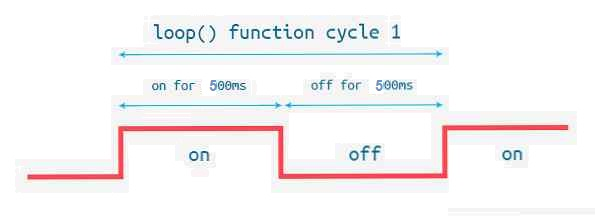

# PRÀCTCIA 1 : BLINK
## **Codi**
~~~
#include <Arduino.h>
void setup() {
 pinMode(LED_BUILTIN,OUTPUT);
 Serial.begin(115200);
}

void loop() {
  digitalWrite(LED_BUILTIN, HIGH);
  delay(500);
  digitalWrite(LED_BUILTIN,LOW);
  delay(500);
  Serial.println(LED_BUILTIN);
}
~~~

## **Diagrama de fluxe**
```mermaid
graph LR
id1(S'encen el led)--> id2(S'imprimeix per pantalla el numero del pin corresponent al output)--> id3(delay de 500 ms)-->id4(S'apaga el led)-->id5(Delay de 500ms)-->id1()
```
## **Diagrama de temps**



## **Quin es el temps lliure del procesador?**

El temps lliure del procesador son aquests 500ms de delay que hi ha entre que s'apaga el led i s'encen.


