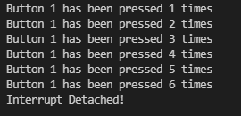

# Pràctica 2
## 2.1 Interrupción por GPIO
### **Codi**
~~~
#include <Arduino.h>

struct Button {
const uint8_t PIN;
uint32_t numberKeyPresses;
bool pressed;
};
Button button1 = {18, 0, false};
void IRAM_ATTR isr() {
button1.numberKeyPresses += 1;
button1.pressed = true;
}
void setup() {
Serial.begin(115200);
pinMode(button1.PIN, INPUT_PULLUP);
attachInterrupt(button1.PIN, isr, FALLING);
}
void loop() {
if (button1.pressed) {
Serial.printf("Button 1 has been pressed %u times\n", button1.numberKeyPresses);
button1.pressed = false;
}
//Detach Interrupt after 1 Minute
static uint32_t lastMillis = 0;
if (millis() - lastMillis > 60000) {
lastMillis = millis();
detachInterrupt(button1.PIN);
Serial.println("Interrupt Detached!");
}
}
~~~
## **Funcionament** 
Primer de tot hem creat un struct on declarem les diferents variables que utilitzarem durant el programa, apart en el Button declarem el PIN en qüestió que conectarem a l'intrruptor, l'estat d'aquest i un sumatori que conti quans cops ha estat pres el botó.

Seguidament en el *void setup* li diem que quan es premi el botó de l'interruptor el PIN 18 canvii d'estat i pasi de HIGH a LOW i llabors es produeix la interrupció.

En el *void loop* podem veure que tenim dos condicions la primera es: " Quan premem l'interruptor mostrar per pantalla el número de cops que em pres el botó". I la segona es: " Si pasa un minut i no s'ha pres cap botó detenir la interrupció, i escriure per pantalla: Interrupt Detached!".

## 2.2 Interrupción por timer
### **Codi**
~~~
#include <Arduino.h>

volatile int interruptCounter;
int totalInterruptCounter;
hw_timer_t * timer = NULL;
portMUX_TYPE timerMux = portMUX_INITIALIZER_UNLOCKED;
void IRAM_ATTR onTimer() {
  portENTER_CRITICAL_ISR(&timerMux);
interruptCounter++;
portEXIT_CRITICAL_ISR(&timerMux);
}
void setup() {
Serial.begin(115200);
timer = timerBegin(0, 80, true);
timerAttachInterrupt(timer, &onTimer, true);
timerAlarmWrite(timer, 1000000, true);
timerAlarmEnable(timer);
}
void loop() {
if (interruptCounter > 0) {
portENTER_CRITICAL(&timerMux);
interruptCounter--;
portEXIT_CRITICAL(&timerMux);
totalInterruptCounter++;
Serial.print("An interrupt as occurred. Total number: ");
Serial.println(totalInterruptCounter);
}
}
~~~
## **Funcionament** 
La funció d'aquest programa es que cada un cert temps ocurreixi una interrupció de manera automàtica  sense necesitat de premer cap botó.

Primer de tot hem de declarar les diferents variables que necesitarem.Seguidament en el void setup declarem el timer, el qual determina el temps que pasa entre cada interrupció. 

En el loop s'ha programat un sumatori de manera que conti les interrupcions que s'han produit i les mostri per pantalla amb el missatge seguent: "An interrupt as occurred. Total number: //aqui ens dirà el total d'interrupcions que portem."

Així doncs el programa una vegada compilat ens dona la següent sortida:

