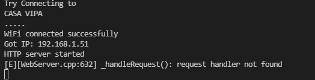
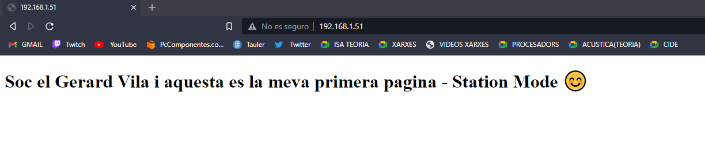
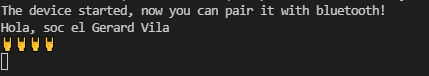
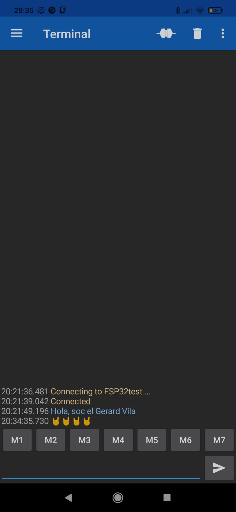

# PRÀCTICA 3 : WIFI I BLUETOOTH
## 3.1 Generació de una pàgina web
### **Codi**
~~~
#include <Arduino.h>
#include <WiFi.h>
#include <WebServer.h>
// SSID & Password
// HTML & CSS contents which display on web server
String HTML = "<!DOCTYPE html>\
<html>\
<body>\
<h1>Soc el Gerard Vila i aquesta es la meva primera pagina - Station Mode &#128522;</h1>\
</body>\
</html>";
const char* ssid = "NOM WIFI"; // Enter your SSID here
const char* password = "CONTRASENYA  WIFI"; //Enter your Password here
WebServer server(80); // Object of WebServer(HTTP port, 80 is defult)
void handle_root() {
server.send(200, "text/html", HTML);
}

void setup() {
Serial.begin(115200);
Serial.println("Try Connecting to ");
Serial.println(ssid);
// Connect to your wi-fi modem
WiFi.begin(ssid, password);
// Check wi-fi is connected to wi-fi network
while (WiFi.status() != WL_CONNECTED) {
delay(1000);
Serial.print(".");
}
Serial.println("");
Serial.println("WiFi connected successfully");
Serial.print("Got IP: ");
Serial.println(WiFi.localIP()); //Show ESP32 IP on serial
server.on("/", handle_root);
server.begin();
Serial.println("HTTP server started");
delay(100);
}

void loop() {
server.handleClient();
}
~~~
### **Funcionament**
Per començar en aquesta pràctica hem d'incluir les llibreries que ens permeten connectar-nos a internet(#include <WiFi.h>) i poder tenir un servidor web(#include <WebServer.h>).

Seguidament creem el que serà la interfaç de la nostra pàgina web, per fer-ho utilitzem el llenguatge html. Posteriorment hem d'introduir les dades de la nostre Wifi per tal de que la placa es pugui connectar a ella i pugui crear el servidor web.

En el *void setup* es on tenim el procès per connectar la placa  a la Wifi i comprovar que aquesta s'hagi conenctat correctament, en cas afirmatiu ens mostrarà per pantalla un missatge dient que la connecció es correcta i posteriorment ens donarà la direcció IP del servidor web que haurem de copiar al nostre navegador. 

En el *void loop* el que fem es cridar la funcio *handleClient();* el que fa es mantenir el servidor actualitzat de posibles canvis a la pàgina web.

Si tot es correcte en el monitor de Platformio hauriem de veure el seguent:

Si introduim la direcció IP al nostre navegador ens sortirà la pàgina web que hem creat, en el meu cas té aquesta interfaç:

## 3.2 Comunicació Bluetooth amb el mòbil
### **Codi**

~~~
#include <Arduino.h>
#include "BluetoothSerial.h"

#if !defined(CONFIG_BT_ENABLED) || !defined(CONFIG_BLUEDROID_ENABLED)
#error Bluetooth is not enabled! Please run `make menuconfig` to and enable it
#endif
BluetoothSerial SerialBT;
void setup() {
Serial.begin(115200);
SerialBT.begin("ESP32test"); //Bluetooth device name
Serial.println("The device started, now you can pair it with bluetooth!");
}
void loop() {
if (Serial.available()) {
SerialBT.write(Serial.read());
}
if (SerialBT.available()) {
Serial.write(SerialBT.read());
}
delay(20);
}

~~~

### **Funcionament**
Tal i com hem fet en l'apartat anterior, primer hem d'incluir les llibreries corresponents, en aquest cas la del Bluetooth *#include "BluetoothSerial.h"*.

Aquest programa ens permetrà connectar la placa a una app del nostre mòbil mitjançant el Bluetooth, per tant primer el que hem de comprovar es que el Bluetooth estigui habilitat, si es el cas el programa ens mostrarà per pantalla que la placa ja està preparada per fer la connexió amb el nostre dispositiu mòbil.

En el *void loop* tenim un bucle on el que fa es comprovar si des de el nostre dispositiu mòbil em enviat algun missatge per mostrar-lo per pantalla, si es així el programa ens mostrarà el que hem escrit al mòbil al nostre monitor del Platformio.

Si ho hem fet correctament, el monitor mostrarà el següent:

Com es pot veure el que he enviat des del mòbil s'ha imprès per pantalla.

