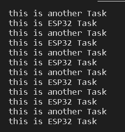

# Pràctica 4: Sistemes operatius en temps real
## 4.1 Exercici pràctic 1
### **Codi**

~~~
#include <Arduino.h>
void anotherTask( void * parameter )
{
/* loop forever */
for(;;)
{
Serial.println("this is another Task");
delay(1000);
}

/* delete a task when finish,
this will never happen because this is infinity loop */
vTaskDelete( NULL );
}

void setup()
{
Serial.begin(112500);
/* we create a new task here */
xTaskCreate(
anotherTask, /* Task function. */
"another Task", /* name of task. */
10000, /* Stack size of task */
NULL, /* parameter of the task */
1, /* priority of the task */
NULL); /* Task handle to keep track of created task */
}
/* the forever loop() function is invoked by Arduino ESP32 loopTask */
void loop()
{
Serial.println("this is ESP32 Task");
delay(1000);
}
~~~

## **Funcionament**

En el *void antoherTask* el que fa es una funció per crear una tasca nova. Aquesta consisteix de un bucle on pel port sèrie escriu: "This is antoher task", per parar aquest bucle infinit es crea la funció *vtaskDelete*, com hem dit la seva funció es aturar la tasca quan aquesta s'hagi acabat.

En quant al *void setup* creem una nova tasca utilitzant la funció anterior. El nom de la tasca que hem creat es dirà "antoher Task".

Per últim en el *void loop* sencillament imprimim per pantalla "This is ESP32 Task", ho fem amb un delay de 1 segon.

Si tot va bé pel port sèrie ens hauria de sortir el següent:

## 4.2 Exercici Pràctic 2 (Semàfor)
### **Codi**
~~~
#include <Arduino.h>
long debouncing_time = 150; 
volatile unsigned long last_micros;
 
SemaphoreHandle_t interruptSemaphore;
void interruptHandler() {
  xSemaphoreGiveFromISR(interruptSemaphore, NULL);
}
 
void TaskLed(void *pvParameters)
{
  (void) pvParameters;
  pinMode(8, OUTPUT);
  for (;;) {
    if (xSemaphoreTake(interruptSemaphore, portMAX_DELAY) == pdPASS) {
      digitalWrite(8, !digitalRead(8));
    }
  }
}
void TaskBlink(void *pvParameters)
{
  (void) pvParameters;
  pinMode(7, OUTPUT);
  for (;;) {
      digitalWrite(7, HIGH);
      vTaskDelay(200 / portTICK_PERIOD_MS);
      digitalWrite(7, LOW);
      vTaskDelay(200 / portTICK_PERIOD_MS);
  }
}
void debounceInterrupt() {
  if((long)(micros() - last_micros) >= debouncing_time * 1000) {
    interruptHandler();
    last_micros = micros();
  }
}
 
void setup() {
  pinMode(2, INPUT_PULLUP);
  xTaskCreate(TaskLed,  "Led", 128, NULL, 0, NULL );
xTaskCreate(TaskBlink,  "LedBlink", 128, NULL, 0, NULL );
  interruptSemaphore = xSemaphoreCreateBinary();
  if (interruptSemaphore != NULL) {
    attachInterrupt(digitalPinToInterrupt(2), debounceInterrupt, LOW);
  }
}
 
void loop() {}
~~~

### **Funcionament**
Primer de tot agreguem la llibreria *#include <Arduino.h>*, declarem el temps de rebot(*long debouncing_time=150;) i declarem el paràmetre *SemaphoreHandle_t interruptSemaphore;* on en la variable *interruptSemaphore* guardarem les dades del semàfor. 

Seguidament declarem una sèrie de funcions on declarem els diferents paràmetres per tal de que el semàfor funcioni correctament. Són les següents:
- *void interruptHandler()* : Aquesta funció senzillament crida a una funció anomenada *xSemaphoreGiveFromISR* la seva funció es encendre el led quan el TaskLed li demani.

- *void debounceInterrupt()* : Aquesta funció es l'encarregada d'implementar el ISR. Farà que la interrupció del led funcioni correctament.

- *void TaskLed()* : En aquest void declarem que un led està conectat al pin 8 i apliquem un bucle per tal de que s'encengui i s'apagui quan toca. 

- *void TaskBlink()*: Declarem un led al pin 7 i li fem un bucle de manera que s'encengui durant 2 segons i es mantingui apagat 2 segons.

En el *void setup* declarem al pin 2 l'interruptor i creem dos tasques les quals els hi pasem les funcions *TaskLed* i *TaskBlink*. També amb la funció *xSemaphoreCreateBinary()* crearem un semàfor i utilitzant les funcions anteriors podem configurar el semàfor perquè funcioni correctament.

Pel que fa el *void loop* quedarà buit.

