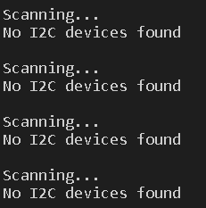

# Pràctica 5: Busos de comunicació 
## 5.1 Escàner I2C
### **Codi**
~~~
#include <Arduino.h>
#include <Wire.h>
void setup()
{
Wire.begin();
Serial.begin(115200);
while (!Serial); 
Serial.println("\nI2C Scanner");
}
void loop()
{
byte error, address;
int nDevices;
Serial.println("Scanning...");
nDevices = 0;
for(address = 1; address < 127; address++ )
{
// The i2c_scanner uses the return value of
// the Write.endTransmisstion to see if
// a device did acknowledge to the address.
Wire.beginTransmission(address);
error = Wire.endTransmission();
if (error == 0)
{
Serial.print("I2C device found at address 0x");
if (address<16)
Serial.print("0");
Serial.print(address,HEX);
Serial.println(" !");
nDevices++;
}
else if (error==4)
{
Serial.print("Unknown error at address 0x");
if (address<16)
Serial.print("0");
Serial.println(address,HEX);
}
}
if (nDevices == 0)
Serial.println("No I2C devices found\n");
else
Serial.println("done\n");
delay(5000); // wait 5 seconds for next scan
}
~~~

### **Funcionament**
Com sempre primer de tot hem d'incloure les llibreries, en aquest cas necessitem la llibreria d'arduino *#include <Arduino.h> i la llibreria *#include <Wire.h>*.

Al *void setup* inicialitzem la llibreria *wire* i el serial, mentres que no es detecti cap serial el programa treurà el següent missatge pel port sèrie: "\nI2C Scanner" , aquest ens diu que està buscant el dispositiu I2C.

Seguidament en el *void loop* creem un contador del número de dispositius que s'han detectat, aquest número ho guardarem a la variable *nDevices*. Paral·lelment amb aquest procès el programa mostra un missatge que ens dirà que està escanejant els dispositius que hi poden haver. 

Posteriorment creem un bucle on li passem la variable *address* de tipus *byte*, aquest bucle ens permetrà veure amb quina direcció de les 127 possibles està conectat el dispositiu. Un cop sabem l'adreça del dispositiu inicialitzem la transmissió utilitzant *begin.Transmission(address);* com es pot veure li hem pasat l'adreça obtinguda. Si la transmissió ha funcionat correctament el programa imprimexi per pantalla un missatge amb la direcció del dispositiu, en cas contrari ens mostra una senyal d'error en aquesta direcció.

En el cas de que no hi hagi cap dispositiu (nDevices=0) el programa escriurà un missatge avisant d'aquest fet pel port sèrie, en cas de que s'hagi trobat ens mostrarà un missatge dient que està correcte. 
Per últim es interessant dir que el programa espera 5 segons entre scan i scan.

Per aquesta pràctica no he pogut aconseguir el dispositiu I2C per tant el que hem mostra el programa pel monitor són els missatges d'error esmentats anteriorment.

