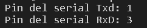

# Pràctica 8: Busos de comunicació IV(uart)
## 8.1 Bucle de comunicació uart2
### **Codi**
~~~
#include <Arduino.h>
#define RXD2 16
#define TXD2 17

void setup()
{
  Serial.begin(115200);
  Serial2.begin(115200, SERIAL_8N1, RXD2, TXD2);
  Serial.println("Serial Txd is on pin: "+String(TX));
  Serial.println("Serial Rxd is on pin: "+String(RX));
}

void loop()
{
  while (Serial2.available()) 
  {
    Serial.print(char(Serial2.read()));
  }
  while (Serial.available())
  {
    Serial2.print(char(Serial.read()));
  }
}
~~~
### **Funcionament**
Començarem definint la llibreria Arduino i  les senyals de comunicació RxD i TxD.

 En el *void setup* inicialitzem dos serials, en el primer hi pasarem com a paràmetre la velocitat del monitor, en el nostre cas 115200, i en el segon serial a part de la velocitat hi pasem la variable *SERIAL_8N1* i les variables de les dos comunicacions definides al començament. Finalment utilitzant la funció *println()* el programa imprimeix el pin del serial TxD i RxD.

 En el *void loop* fem un bucle on li diem al programa que mentres que les comunicacions del serial2(RxD i TxD) estiguin disponibles, llegeixi les dades i les imprimeixi al serial1. 
 Finalment fem un altre bucle on es llegeix el serial1 i les dades d'aquest les imprimeix el serial2.

 En aquesta pràctica s'ha utilitzat el nivell de comnunicació RS232 i les funcions *println()*,*read()*,*available()*, entre altres.

 Si tot va bé el programa ens hauria de mostrar pel monitor el següent:

